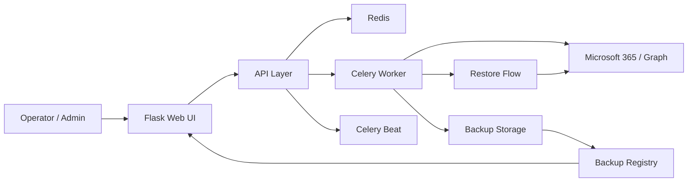
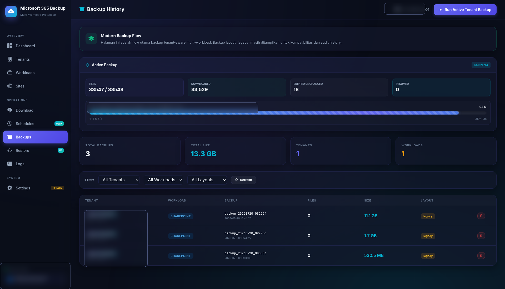
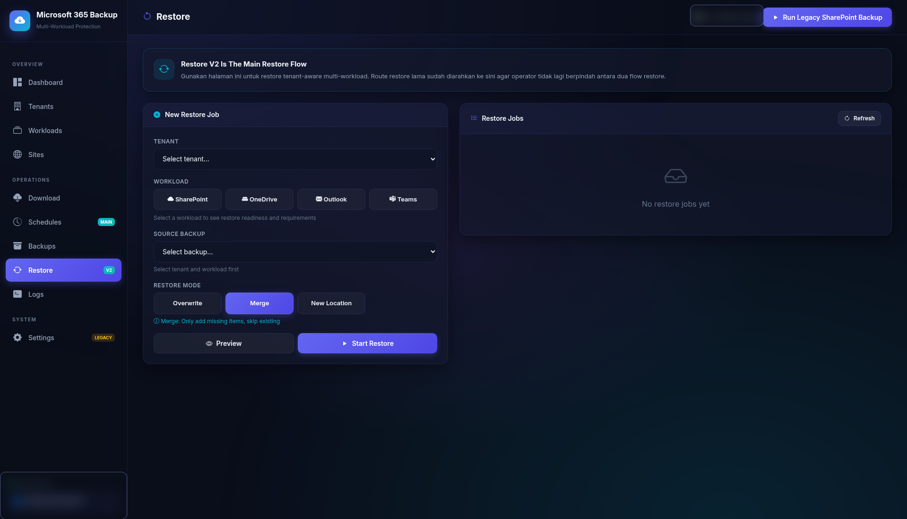

# Microsoft 365 Backup

Self-hosted Microsoft 365 Backup Platform for SharePoint, OneDrive,
Outlook, Teams, and Multi-Tenant Environments.

Run backups on your own infrastructure, keep control of your data,
schedule jobs centrally, and restore workloads from a modern web dashboard.

---

✅ Self-Hosted

✅ Multi-Tenant Ready

✅ Docker Native

✅ Real Backup History

✅ Background Job Processing

✅ Restore Workflows

✅ Enterprise Visibility

## Executive Summary

`Microsoft 365 Backup` is a self-hosted backup and restore platform for Microsoft 365 workloads.
It is designed for teams that want their backup system to be:

- infrastructure-controlled
- operationally visible
- extensible by developers
- ready for tenant-aware administration
- usable through a real web interface, not just scripts

This repository combines:

- a web dashboard for daily operators
- background workers for long-running backup jobs
- tenant-aware configuration and workload routing
- backup inventory and restore-oriented history
- scheduling, notifications, logs, and recovery workflows

The current product direction is centered on SharePoint backup execution, while OneDrive, Outlook, and Teams are already present in the architecture and product surface for continued hardening.

## Visual Dashboard

The product ships with a modern operational dashboard for monitoring active jobs, viewing backup statistics, and navigating tenants, workloads, restore, logs, and schedules.


Primary dashboard capabilities:

- launch legacy SharePoint backup runs
- monitor active backup state in real time
- view files processed, speed, ETA, skipped files, and resumed files
- inspect recent backup history without leaving the UI
- track site enablement and operational status from one screen

## Feature Highlights

### SharePoint Backup

Used for:

- backing up enabled SharePoint sites and document libraries
- tracking progress with files, throughput, and ETA
- skipping unchanged files to reduce unnecessary transfer
- supporting interruption-aware backup behavior

### OneDrive Foundation

Used for:

- preparing user-drive backup flows
- building tenant-aware target discovery
- extending the platform toward broader Microsoft 365 data coverage

### Outlook Foundation

Used for:

- preparing mailbox-oriented backup flows
- enabling future recovery workflows for mail workloads
- separating workload logic from the SharePoint-only legacy model

### Teams Foundation

Used for:

- exposing Teams as a first-class workload in the platform
- supporting metadata and export-oriented recovery direction
- extending tenant-aware workload orchestration

### Multi-Tenant Management

Used for:

- storing tenant connection settings
- isolating backup context by tenant
- supporting per-tenant schedules and notifications

### Backup Inventory

Used for:

- listing backup history across legacy and tenant-aware layouts
- showing size, workload, tenant, layout, and date metadata
- acting as the main source before restore or audit activity

### Restore Workflows

Used for:

- reviewing available backup sources
- validating recovery readiness
- orchestrating restore v2 operations from a dedicated surface

### Schedules and Notifications

Used for:

- scheduling backup jobs centrally
- configuring per-tenant cron behavior
- attaching email, Telegram, or Teams reporting channels

## Architecture

The platform is built as a Docker-native application stack.

Core components:

- `Flask`: web UI and API surface
- `Celery`: background task processing
- `Redis`: task queue, task state, and operational coordination
- `Docker Compose`: portable deployment and service orchestration

High-level flow:

1. Operator configures tenant, schedule, or workload from the UI.
2. Web app writes and serves configuration from the application layer.
3. Celery workers execute backup or restore jobs in the background.
4. Redis coordinates job state and live progress.
5. Backup data is written to storage controlled by the operator.
6. Registry and restore flows expose the resulting backup history back to the UI.



Repository shape:

```text
m365backup/
├── README.md
├── docs/
│   ├── assets/
│   ├── AUDIT_CHECKLIST_TEMUAN.md
│   ├── CHECKLIST_EKSEKUSI_STATUS.md
│   └── PRD_CHECKLIST_REMEDIASI.md
└── spo-backup-final/
    ├── app/
    ├── docker-compose.yml
    ├── Dockerfile
    ├── install-fixed.sh
    ├── config.example.json
    └── .env.example
```

## Screenshots

Dashboard and active backup monitoring:


Backup history and inventory page:



Restore and recovery operations preview:



> Screenshots in the repository are captured from the real running application, with only sensitive areas selectively blurred to protect tenant names, operator identity, task identifiers, and environment-specific details.

## Why Choose This Project

Choose this project if you want:

- a Microsoft 365 backup platform you can host yourself
- more visibility than opaque SaaS backup tooling
- a codebase that can be audited, patched, and extended
- Docker-based deployment without hardcoded NAS-specific paths
- a product direction that already supports multi-tenant growth

This project is especially useful for:

- internal infrastructure teams
- IT operations teams
- managed service teams
- engineers building customized Microsoft 365 backup workflows

## Production Features

Available production-facing capabilities today:

| Feature | Purpose | Current State |
|---|---|---|
| SharePoint Backup | Back up enabled SharePoint sites and libraries | Active |
| Live Progress Dashboard | Show throughput, ETA, skipped files, resumed files, and task state | Active |
| Backup Registry | Track backup inventory across legacy and tenant-aware layouts | Active |
| Restore v2 | Prepare and execute recovery workflows from backup history | Active |
| Tenant Management | Store and validate Microsoft 365 tenant connections | Active |
| Per-Tenant Scheduling | Run backup schedules and notifications by tenant | Active |
| Logs and Audit Support | Review operational events and troubleshoot incidents | Active |
| OneDrive Foundation | Extend the platform beyond SharePoint | In Hardening |
| Outlook Foundation | Extend the platform into mailbox recovery workflows | In Hardening |
| Teams Foundation | Extend the platform into Teams-oriented backup flows | In Hardening |

Current engineering focus as of Monday, July 20, 2026:

- improving SharePoint interruption and resume integrity
- tightening backup snapshot consistency
- hardening worker and Redis interruption handling
- maturing OneDrive and Outlook flows further

## Security Features

Security and repo-safety controls included in this repository:

| Security Area | What It Provides |
|---|---|
| Self-Hosted Deployment | Data stays on infrastructure you control |
| Non-Root Runtime | Web, worker, and beat run without root privileges |
| Secret Exclusion | Local runtime config and secrets stay outside Git |
| Public Templates | Example config and env files are safe for sharing |
| Runtime Separation | Backup payload, logs, and Redis state stay outside repo source |
| Operational Visibility | Logs and task state make failures easier to inspect |

Sensitive paths intentionally excluded from Git:

- `data/`
- `logs/`
- `redis/`
- `config/config.json`
- `spo-backup-final/config.json`
- `spo-backup-final/.env`

If real secrets were ever used locally, rotate them before public release:

- Azure / Entra `client_secret`
- SMTP password
- Telegram bot token
- Teams webhook URLs

## Roadmap

Planned and active hardening areas:

### Near-Term

- finalize deterministic SharePoint resume behavior
- improve snapshot integrity for interrupted backup runs
- strengthen restore validation across workloads

### Mid-Term

- continue hardening OneDrive and Outlook flows
- tighten modern vs legacy product boundaries
- improve backup and restore contract consistency across UI and backend

### Ongoing

- improve benchmark and smoke-test coverage
- refine product UX for operators and administrators
- keep public documentation aligned with real feature readiness

Detailed tracking lives in:

- [docs/AUDIT_CHECKLIST_TEMUAN.md](docs/AUDIT_CHECKLIST_TEMUAN.md)
- [docs/CHECKLIST_EKSEKUSI_STATUS.md](docs/CHECKLIST_EKSEKUSI_STATUS.md)
- [docs/PRD_CHECKLIST_REMEDIASI.md](docs/PRD_CHECKLIST_REMEDIASI.md)

## Quick Start

```bash
cd spo-backup-final
cp .env.example .env
mkdir -p ../config ../data ../logs ../redis
cp -n config.example.json ../config/config.json
docker compose up -d --build
```

Open the application:

```text
http://<host>:5050
```

Public-safe repo notes:

- runtime backup data stays outside Git
- runtime config stays outside Git
- example config files are included for sharing and onboarding

## Developer Guide

The active application package lives in:

- [spo-backup-final/README.md](spo-backup-final/README.md)

Main developer entry points:

- `spo-backup-final/app/main.py`
- `spo-backup-final/app/tasks.py`
- `spo-backup-final/app/backup_engine.py`
- `spo-backup-final/app/backup_registry.py`
- `spo-backup-final/app/templates/`
- `spo-backup-final/app/workloads/`
- `spo-backup-final/app/restore/`

Useful docs for contributors:

- audit findings: [docs/AUDIT_CHECKLIST_TEMUAN.md](docs/AUDIT_CHECKLIST_TEMUAN.md)
- execution checklist: [docs/CHECKLIST_EKSEKUSI_STATUS.md](docs/CHECKLIST_EKSEKUSI_STATUS.md)
- remediation PRD: [docs/PRD_CHECKLIST_REMEDIASI.md](docs/PRD_CHECKLIST_REMEDIASI.md)

Typical developer tasks:

- adjust Docker deployment behavior
- extend workload modules
- improve backup and restore state handling
- harden UI and backend contracts
- add tenant-aware operational features

Local development starting points:

```bash
cd spo-backup-final
docker compose up -d --build
docker compose logs -f spo-backup
docker compose logs -f celery-worker
```
