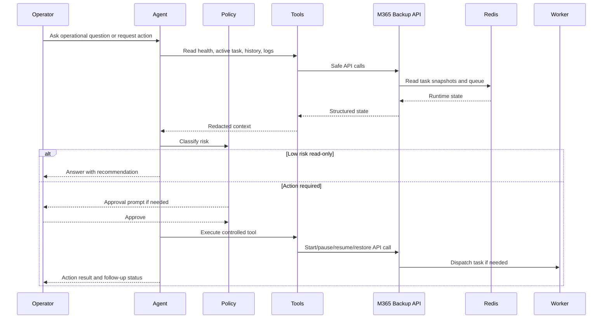

# PRD: AI Agent Automation for Microsoft 365 Backup

Last updated: 2026-07-29  
Status: Draft / proposed integration  
Related technical doc: `docs/TECH_STACK_DETAIL.md`

---

## 1. Executive Summary

Microsoft 365 Backup already has the foundations needed for AI-assisted operations:

- task state and progress snapshots
- backup history and manifests
- tenant-aware workload configuration
- restore preview and restore jobs
- queueing for backup, download, and restore
- remote destination validation
- notification testing
- logs and health endpoints

The proposed AI agent integration adds an automation layer on top of the current application. The agent should help operators understand what is happening, recommend safe next actions, and execute controlled workflows through approved tools.

The agent must not replace the backup engine. It should orchestrate the existing app through safe API/tool calls.

---

## 2. Product Goal

Build an AI-assisted operations layer that can:

- answer operational questions about backup status, failures, queues, and restore readiness
- triage slow, stalled, failed, or interrupted backup jobs
- recommend resume, retry, cancel, or restore actions based on real app state
- automate repetitive runbook checks
- generate backup coverage and compliance reports
- safely start backup and restore workflows after policy checks
- support future integration with Omni Router, MCP-style tools, ChatOps, or similar agent routers

---

## 3. Non-Goals

- Do not let the agent directly edit `config.json`.
- Do not let the agent directly mutate Redis keys.
- Do not let the agent read arbitrary backed-up file contents by default.
- Do not perform restore overwrite without explicit human approval.
- Do not perform cross-tenant copy without explicit human approval.
- Do not delete backups automatically in the first release.
- Do not replace the existing web UI.
- Do not replace Celery workers or the existing backup engine.

---

## 4. Primary Personas

| Persona | Needs |
|---|---|
| Backup Operator | Ask what is running, what failed, what can be resumed, and what needs attention |
| Microsoft 365 Admin | Understand missing Graph permissions, tenant readiness, and workload coverage |
| Infrastructure Admin | Monitor storage, runtime health, remote destination health, and queue status |
| Incident Responder | Quickly triage stalled jobs, permission failures, and restore requirements |
| Compliance Reviewer | Generate backup evidence reports without exposing sensitive content |

---

## 5. Key User Stories

### Operational Q&A

- As an operator, I can ask "what backup is running now?" and get task ID, workload, tenant, progress, speed, ETA, current file, and queue status.
- As an operator, I can ask "why is backup slow?" and get a triage summary based on logs, progress delta, Graph errors, retry count, and file size behavior.
- As an admin, I can ask "which workloads are not production-ready?" and get a tenant-aware readiness summary.

### Assisted Actions

- As an operator, I can ask the agent to pause or resume the active backup.
- As an operator, I can ask the agent to start a backup for enabled workloads.
- As an admin, I can ask the agent to test Microsoft Graph permissions for a tenant.
- As an admin, I can ask the agent to test a remote destination and explain the failure.

### Restore and Copy

- As an operator, I can ask the agent to find backup candidates for a restore.
- As an operator, I can ask the agent to run restore preview before starting a restore job.
- As an admin, I can ask the agent to prepare cross-tenant copy, but it must require explicit approval before execution.

### Reporting

- As an admin, I can ask for a daily backup coverage report.
- As an incident responder, I can ask for a failed backup report with likely cause and recommended next action.
- As a compliance reviewer, I can ask for a tenant/workload evidence summary without exposing file contents.

---

## 5.1 Current App Alignment

The current Microsoft 365 Backup application already provides the backend foundation for most agent workflows, but it does not yet include an agent router, MCP server, or AI tool adapter.

| Area | Current app status | Agent readiness |
|---|---|---|
| Health endpoint | Available | Ready for read-only tool wrapping |
| Active backup/download task polling | Available | Ready for read-only tool wrapping |
| Backup queue | Available | Ready for read-only and action tool wrapping |
| Backup history registry | Available | Ready for read-only tool wrapping |
| Backup manifests and size cache | Available | Ready for inspection tool with redaction |
| Tenant CRUD and tenant test | Available | Ready for controlled tool wrapping |
| Workload discovery and target selection | Available | Ready for controlled tool wrapping |
| Backup start/pause/resume/cancel | Available | Ready for controlled tool wrapping with policy |
| Restore preview and restore jobs | Available | Ready for approval-gated tool wrapping |
| Cross-tenant restore/copy model | Available in restore flow | Requires strict approval gate |
| Remote destination test | Available | Ready for controlled tool wrapping |
| Notification test | Available | Ready for controlled tool wrapping |
| Agent audit log | Not implemented | Required before action automation |
| Secret redaction utility for agent context | Not implemented as a dedicated agent layer | Required before model/router integration |
| Omni Router / MCP-style tool endpoint | Not implemented | Proposed integration |

## 5.2 Feature Graph Alignment

The full current-app plus AI-agent topology is maintained in `docs/TECH_STACK_DETAIL.md`, section `22.3 Full App + AI Agent Feature Graph`.

The graph intentionally separates:

- current runtime components: Flask API, web UI, Redis, Celery workers, Celery Beat, backup registry, config, logs, backup filesystem
- current feature surfaces: Dashboard, Tenants, Workloads, Sites, Download, Schedules, Backups, Restore, Settings, Logs
- current workload engines: SharePoint, OneDrive, Outlook, Teams, restore engines, remote upload, notification service
- external systems: Microsoft Entra ID, Microsoft Graph, remote storage, notification channels
- proposed AI layer: Agent Console, Omni Router, Policy Guard, Tool Adapter, Agent Audit Log

This split is important so the roadmap does not imply that AI automation is already running in production. The app is agent-ready at the API and workflow level, but the router, approval gate, tool adapter, and audit memory still need to be implemented before production AI operations.

---

## 6. Proposed Agent Capability Matrix

| Capability | Priority | Risk | Required approval | Notes |
|---|---:|---|---|---|
| Read system health | P0 | Low | No | Safe read-only tool |
| Read active operations | P0 | Low | No | Backup/download/restore/queue |
| Read backup history | P0 | Low | No | Redact sensitive tenant fields if needed |
| Read recent logs | P0 | Medium | No | Must redact secrets/tokens/webhooks |
| Summarize failed backup | P0 | Low | No | Uses logs + backup manifest |
| Explain missing permissions | P0 | Low | No | Uses tenant test and workload metadata |
| Test tenant permissions | P1 | Medium | No | Action but non-destructive |
| Test notification | P1 | Medium | No | Can send real message |
| Test remote destination | P1 | Medium | No | Can create/delete probe path |
| Start backup | P1 | Medium | Optional | Approval recommended for production |
| Pause backup | P1 | Medium | No | Should be reversible |
| Resume backup | P1 | Medium | No | Should resume existing task/project |
| Cancel backup | P1 | High | Yes | Can interrupt work |
| Restore preview | P1 | Medium | No | Required before restore |
| Start restore merge/new location | P2 | High | Yes | Must show exact target |
| Restore overwrite | P2 | Critical | Yes | Explicit approval required |
| Cross-tenant copy | P2 | Critical | Yes | Explicit approval required |
| Delete backup | P3 | Critical | Yes | Add later after retention policy |
| Update schedule | P3 | High | Yes | Must explain beat/reload behavior |
| Update secrets | P3 | Critical | Yes | Never echo secret value |

---

## 7. Recommended Tool Contract

### 7.1 Read-Only Tools

| Tool name | Input | Output |
|---|---|---|
| `get_system_health` | none | app health, Redis health, worker visibility, current time |
| `get_active_operations` | none | active backup/download/restore, task IDs, queue length |
| `list_backup_projects` | filters: tenant, workload, status | grouped backup projects |
| `inspect_backup_project` | backup project ID/path | manifest, files count, size, status, restore readiness |
| `read_recent_activity` | line count, severity filter | redacted log tail |
| `list_tenants_safe` | none | tenants with secrets masked |
| `get_workload_readiness` | tenant ID | workload enabled state, Graph scope hints, last test result |
| `get_remote_destinations_safe` | none | destination names, protocols, enabled state, secrets masked |
| `get_schedule_summary` | tenant ID optional | per-tenant schedule summary and legacy compatibility summary |

### 7.2 Controlled Action Tools

| Tool name | Input | Output |
|---|---|---|
| `test_tenant_permissions` | tenant ID | Graph readiness result |
| `test_remote_destination` | destination ID | protocol-specific test result |
| `test_notification_channel` | channel | send result |
| `start_backup` | tenant ID, workloads, target scope | task ID or queue item |
| `pause_operation` | task ID | updated task control state |
| `resume_operation` | task ID | updated task control state |
| `cancel_operation` | task ID, approval token | cancellation result |
| `preview_restore` | tenant, workload, source backup, target | preflight result |
| `start_restore` | restore payload, approval token | restore job ID |
| `start_cross_tenant_copy` | source tenant, target tenant, source backup, target path, approval token | restore/copy job ID |

### 7.3 High-Risk Tools

| Tool name | Input | Safety requirement |
|---|---|---|
| `delete_backup_project` | backup project ID/path | explicit approval + exact path confirmation |
| `update_schedule` | tenant ID, cron, timezone, enabled | explicit approval + validation |
| `save_remote_destination` | destination payload | explicit approval + secret masking |
| `update_tenant_secret` | tenant ID, secret payload | explicit approval + never echo secret |

---

## 8. Security Requirements

### Secret Handling

- The agent must never display:
  - Azure client secrets
  - remote destination passwords
  - SMTP passwords
  - Telegram bot tokens
  - Teams webhook URLs
  - raw bearer tokens
- Tool responses must mask secrets before sending context to the model.
- Redaction must happen before logs are summarized by the model.

### Action Policy

- Destructive actions require human approval.
- Cross-tenant actions require human approval.
- Restore overwrite requires human approval.
- The agent must show a final action summary before executing high-risk tools:
  - source tenant
  - target tenant
  - workload
  - source backup
  - target path/library
  - expected operation kind

### Access Boundary

- The agent should call application APIs or a local tool adapter.
- The agent should not directly write backup files.
- The agent should not directly mutate Redis state.
- The agent should not directly edit raw config.

---

## 9. Audit Requirements

Every agent action should write an audit event.

Suggested format:

```json
{
  "timestamp": "2026-07-29T00:00:00Z",
  "actor": "agent",
  "operator": "admin@example.com",
  "tool": "start_backup",
  "risk": "medium",
  "approval_required": false,
  "approval_id": null,
  "input_summary": {
    "tenant_id": "masked-or-id",
    "workloads": ["sharepoint", "onedrive"]
  },
  "result_summary": {
    "status": "queued",
    "task_id": "abc123"
  }
}
```

Audit storage options:

- append-only `agent_audit_log.jsonl`
- Redis stream
- application log with a dedicated `AGENT_AUDIT` marker

Recommended first implementation:

- `agent_audit_log.jsonl` under `/app/logs`
- later upgrade to Redis stream or database-backed audit

---

## 10. AI Automation Flow Diagrams

### 10.1 Agent Request Flow



### 10.2 TUI-Style Control Flow

```text
┌─────────────────────────────────────────────────────────────────────┐
│ OPERATOR REQUEST                                                     │
│ "Why is OneDrive backup slow and can I resume it safely?"            │
└───────────────────────────────┬─────────────────────────────────────┘
                                │
                                ▼
┌─────────────────────────────────────────────────────────────────────┐
│ AGENT ROUTER                                                        │
│ 1. classify intent: diagnosis + possible action                     │
│ 2. choose tools: health, active task, history, logs                  │
│ 3. build redacted context                                           │
└───────────────────────────────┬─────────────────────────────────────┘
                                │
                                ▼
┌─────────────────────────────────────────────────────────────────────┐
│ SAFE READ TOOLS                                                     │
│ - get_system_health                                                 │
│ - get_active_operations                                             │
│ - inspect_backup_project                                            │
│ - read_recent_activity                                              │
└───────────────────────────────┬─────────────────────────────────────┘
                                │
                                ▼
┌─────────────────────────────────────────────────────────────────────┐
│ AGENT ANALYSIS                                                      │
│ - active task state                                                 │
│ - speed / live size delta                                           │
│ - current workload and target                                       │
│ - retry or Graph throttling signs                                   │
│ - resume markers and project folder                                 │
└───────────────────────────────┬─────────────────────────────────────┘
                                │
                                ▼
┌─────────────────────────────────────────────────────────────────────┐
│ RECOMMENDATION                                                      │
│ - continue running                                                  │
│ - pause then resume                                                 │
│ - cancel and resume from project                                    │
│ - fix tenant permission                                             │
│ - test remote destination                                           │
└───────────────────────────────┬─────────────────────────────────────┘
                                │
                                ▼
┌─────────────────────────────────────────────────────────────────────┐
│ ACTION POLICY                                                       │
│ Low risk: answer only                                               │
│ Medium risk: execute controlled tool                                │
│ High risk: require approval                                         │
│ Critical: approval + exact target confirmation                      │
└─────────────────────────────────────────────────────────────────────┘
```

---

## 11. Implementation Phases

### Phase 0: Documentation and Contract

- [x] Document AI router architecture in tech stack
- [x] Create PRD for AI agent automation
- [ ] Define tool schema for read-only tools
- [ ] Define redaction rules
- [ ] Define risk classification policy

### Phase 1: Read-Only Agent

- [ ] Implement read-only tool adapter
- [ ] Add health summary tool
- [ ] Add active operation summary tool
- [ ] Add backup history summary tool
- [ ] Add workload readiness summary tool
- [ ] Add redacted log reader
- [ ] Add agent audit log for read actions

Acceptance:

- [ ] Agent can answer current backup status
- [ ] Agent can summarize failed/interrupted backups
- [ ] Agent can explain missing tenant permissions
- [ ] Agent cannot expose secrets

### Phase 2: Assisted Operations

- [ ] Add tenant permission test tool
- [ ] Add remote destination test tool
- [ ] Add notification test tool
- [ ] Add backup start tool
- [ ] Add pause/resume/cancel tools
- [ ] Add approval requirement for cancel

Acceptance:

- [ ] Agent can start a backup for enabled workloads
- [ ] Agent can pause/resume a task
- [ ] Agent can explain queue state after starting a job
- [ ] Cancel requires explicit operator confirmation

### Phase 3: Restore Assistant

- [ ] Add restore preview tool
- [ ] Add restore candidate finder
- [ ] Add target path validation helper
- [ ] Add restore start tool with approval
- [ ] Add cross-tenant copy tool with approval

Acceptance:

- [ ] Agent can find source backup candidates
- [ ] Agent can run restore preflight
- [ ] Agent cannot execute overwrite without approval
- [ ] Agent shows source and target tenant before cross-tenant copy

### Phase 4: Reporting and Optimization

- [ ] Add daily backup summary generator
- [ ] Add failed backup incident report generator
- [ ] Add storage growth report
- [ ] Add throughput diagnosis report
- [ ] Add schedule recommendation engine

Acceptance:

- [ ] Agent can generate useful reports without file-content exposure
- [ ] Agent can recommend schedule changes but cannot apply them without approval

---

## 12. Engineering Tasks

### Backend

- [ ] Add `app/agent_tools.py`
- [ ] Add `app/agent_policy.py`
- [ ] Add `app/agent_audit.py`
- [ ] Add read-only `/api/agent/*` endpoints
- [ ] Add action `/api/agent/actions/*` endpoints
- [ ] Add secret redaction utility
- [ ] Add risk classification helper
- [ ] Add approval token validation for high-risk actions

### Frontend

- [ ] Add optional Agent Console page
- [ ] Add action preview cards for high-risk operations
- [ ] Add approval confirmation modal
- [ ] Add audit log viewer
- [ ] Add AI-generated report panel

### Operations

- [ ] Add environment flag `ENABLE_AGENT_AUTOMATION=false`
- [ ] Add `AGENT_AUDIT_LOG_PATH=/app/logs/agent_audit_log.jsonl`
- [ ] Add optional router endpoint config
- [ ] Add docs for connecting Omni Router or another agent gateway

---

## 13. Open Questions

- Should the first agent UI live inside this Flask app or outside in an existing ChatOps/router interface?
- Should approvals be stored in Redis, config, or a file-backed audit log first?
- Which identity should be attached to agent actions when the app has no user login system yet?
- Should the agent be allowed to read filenames from backup manifests, or only counts and summaries?
- Should schedule recommendation use historical duration only, or also consider Graph throttling and tenant size?

---

## 14. Recommended First Cut

The most useful and lowest-risk first release is a read-only operations assistant.

First release scope:

- system health summary
- active task summary
- backup history summary
- failed backup analysis
- workload readiness explanation
- redacted recent log summary

This gives immediate value without giving the agent authority over destructive or sensitive operations.
