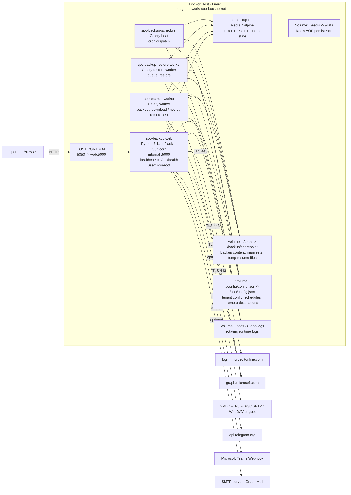
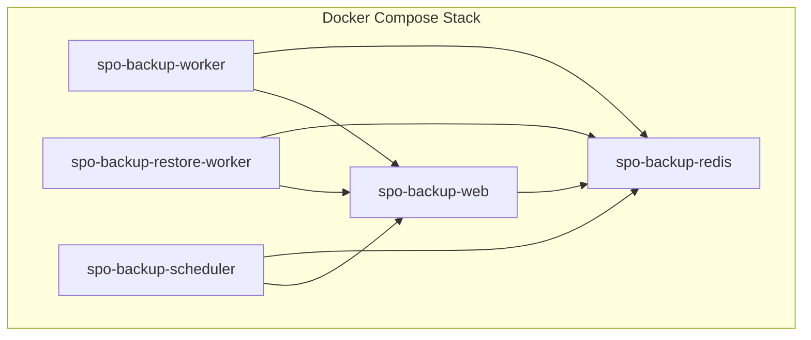
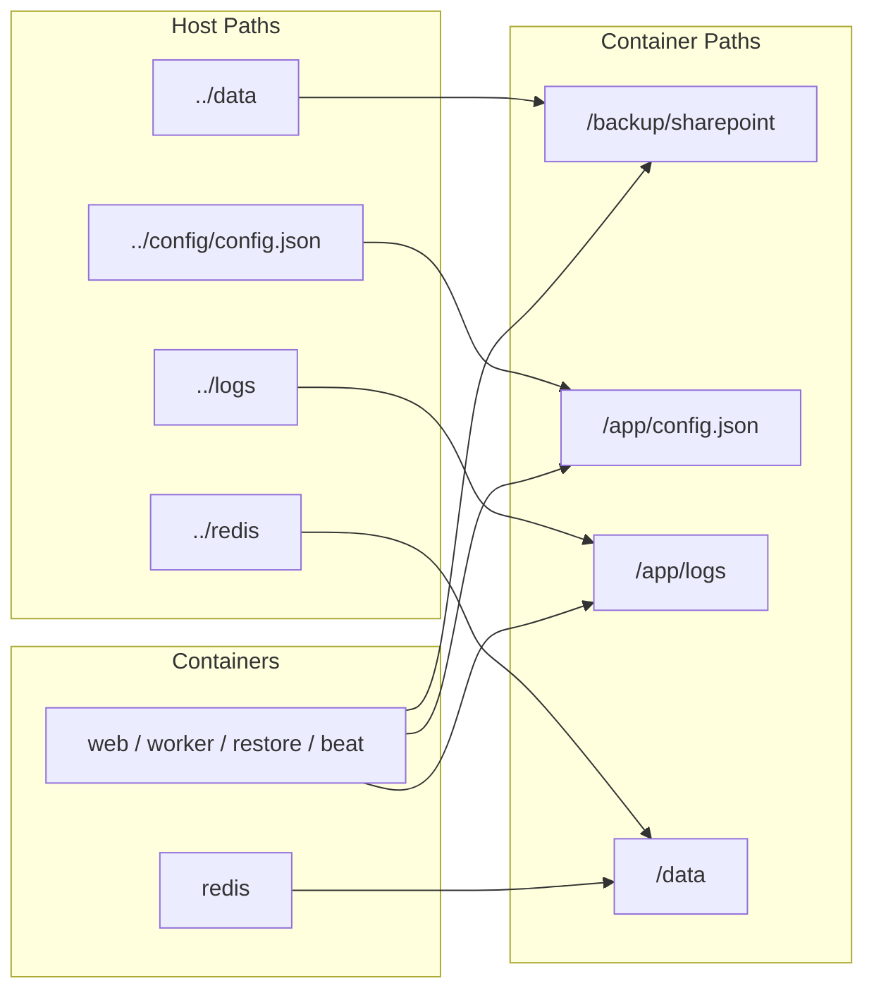
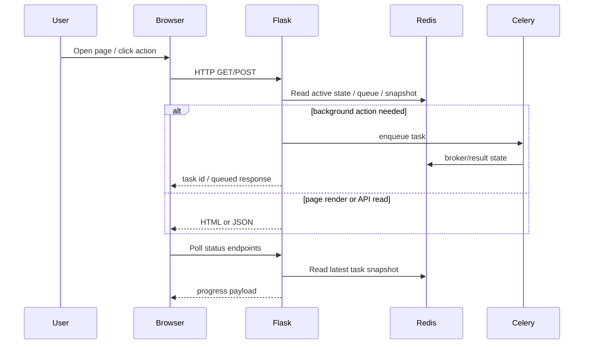
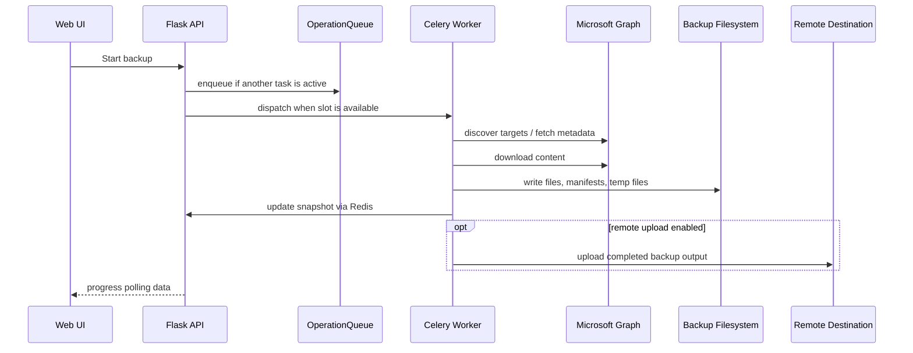
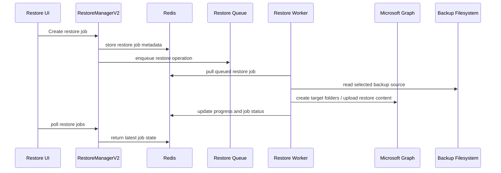
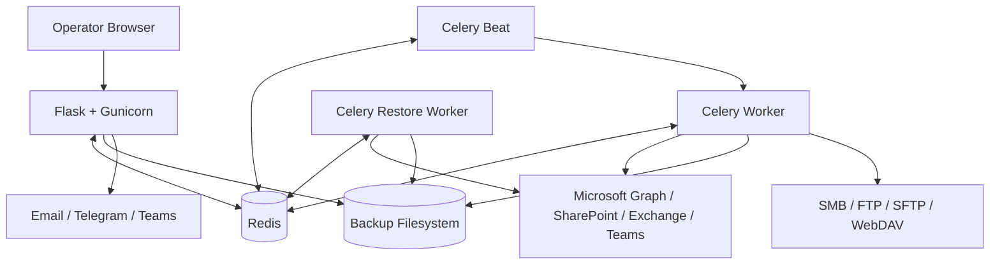

# Microsoft 365 Backup Tech Stack

Last updated: 2026-07-29  
Repository root: `/CASADATA/docker/m365backup`  
Application root: `/CASADATA/docker/m365backup/spo-backup-final`

---

## 1. Executive Summary

This project is a self-hosted, Docker-based Microsoft 365 backup platform built around a Python Flask web application, Celery background workers, Redis coordination, and Microsoft Graph integration.

The current architecture supports:

- Multi-tenant Microsoft 365 credential isolation
- Backup workloads for SharePoint, OneDrive, Outlook, and Teams
- Modern tenant-aware backup history and restore flow
- Legacy SharePoint-compatible backup flow
- Background execution with task control, queueing, and runtime leases
- Remote upload to SMB, FTP/FTPS, SFTP/SSH, and WebDAV
- Operator-facing web UI rendered server-side with Bootstrap and JavaScript

At a high level, the platform is not a SPA and not microservices-heavy. It is a pragmatic modular monolith:

- One Flask app for web UI and APIs
- One shared codebase reused by web, workers, restore worker, and scheduler
- Redis used as broker, result backend, queue store, snapshot cache, and coordination layer
- Filesystem used as the canonical backup storage layer

---

## 2. High-Level Stack Matrix

| Layer | Technology | Version / Source | Role in This Project |
|---|---|---:|---|
| OS container base | Debian slim via Python image | `python:3.11-slim` | Base runtime image |
| Language | Python | 3.11 | Main backend and worker implementation |
| Web framework | Flask | `3.0.3` | UI rendering and API endpoints |
| WSGI server | Gunicorn | `22.0.0` | Production HTTP process manager |
| Async job system | Celery | `5.4.0` | Backup, restore, download, notification, remote test jobs |
| Broker / backend | Redis | `7-alpine`, Python client `5.0.4` | Celery broker, Celery result backend, queue state, task snapshots, leases |
| HTTP client | Requests | `2.32.3` | Microsoft Graph, Teams webhook, WebDAV, general HTTP |
| Auth library | MSAL | `1.28.0` | Azure AD app token acquisition for Microsoft Graph |
| SMB client | pysmb | `1.2.10` | Remote upload to SMB/CIFS shares |
| SSH/SFTP client | Paramiko | `3.4.1` | Remote upload to SFTP/SSH destinations |
| Frontend CSS | Bootstrap | CDN `5.3.3` | Layout, form controls, modal patterns |
| Icons | Bootstrap Icons | CDN `1.11.3` | UI iconography |
| Fonts | Inter, JetBrains Mono | Google Fonts CDN | UI typography |
| Template engine | Jinja2 via Flask | bundled with Flask | Server-rendered HTML pages |
| Persistence | JSON + filesystem | local bind mounts | Config, manifests, backup data, logs |
| Container orchestration | Docker Compose | local file | App deployment model |

---

## 3. Repository Structure and Tech Ownership

### Main application directories

| Path | Purpose | Stack role |
|---|---|---|
| `spo-backup-final/app/main.py` | Flask app entrypoint and route composition | Web runtime |
| `spo-backup-final/app/tasks.py` | Celery task runtime | Background execution |
| `spo-backup-final/app/workloads/` | Modern workload backup engines | Microsoft 365 workload processing |
| `spo-backup-final/app/restore/` | Modern restore engines per workload | Restore processing |
| `spo-backup-final/app/backup_engine.py` | Legacy SharePoint backup engine and custom download engine | Compatibility + direct file engine |
| `spo-backup-final/app/backup_registry.py` | Backup discovery, grouping, history aggregation | Backup catalog layer |
| `spo-backup-final/app/tenant_manager.py` | Multi-tenant config and tenant testing | Tenant management layer |
| `spo-backup-final/app/uploader.py` | Remote destination protocol implementations | Post-backup external transfer |
| `spo-backup-final/app/notifier.py` | Email, Telegram, Teams notifications | Alerting layer |
| `spo-backup-final/app/operation_queue.py` | Redis-backed backup/download/restore queue | Operator queue layer |
| `spo-backup-final/app/task_runtime_lease.py` | Duplicate task suppression and slot locking | Runtime safety layer |
| `spo-backup-final/app/templates/` | Server-rendered UI templates | Frontend layer |
| `spo-backup-final/docker-compose.yml` | Deployment topology | Operations / runtime |
| `spo-backup-final/Dockerfile` | Container image build | Packaging |

### Runtime bind-mounted directories

| Host path source | Container target | Purpose |
|---|---|---|
| `../data` | `/backup/sharepoint` | Primary backup storage |
| `../config/config.json` | `/app/config.json` | Main mutable configuration |
| `../logs` | `/app/logs` | Rotating application logs |
| `../redis` | Redis `/data` | Redis append-only persistence |

---

## 4. Backend Tech Stack

### 4.1 Web Runtime

The web runtime is a Flask application served by Gunicorn.

Implementation:

- Entrypoint: `app.main:app`
- Gunicorn command: `gunicorn --bind 0.0.0.0:5000 --workers 3 --timeout 300 app.main:app`
- Template rendering: Jinja2 templates in `app/templates/`
- Route composition:
  - `register_m365_routes(app)`
  - `register_v11_routes(app)`
  - `register_v12_routes(app)`
  - `register_v13_routes(app)`

What this means architecturally:

- The app is a modular Flask monolith, not a separate API server plus SPA.
- HTML pages and JSON APIs are delivered from the same application.
- Route version modules are used to preserve compatibility while introducing newer features.

### 4.2 API Style

The project uses internal JSON APIs for operator actions, including:

- backup start / pause / resume / cancel
- restore preview / restore execution
- workload discovery and target selection
- tenant CRUD and tenant test
- task active status and progress polling
- remote destination save/test
- settings and schedule endpoints

This is a classic server-rendered app with AJAX polling rather than a frontend build pipeline.

### 4.3 Configuration Model

Configuration is stored as JSON and managed through:

- `app/config_manager.py`
- mutable file: `/app/config.json`

Characteristics:

- Read/write protected by a Python thread lock
- Backup `.bak` copy is created before overwrite
- Legacy config and multi-tenant config coexist in a normalized compatibility model

### 4.4 Tenant Layer

`app/tenant_manager.py` provides:

- tenant CRUD
- active tenant selection
- compatibility mapping from legacy config into a pseudo-tenant
- tenant connection test against Microsoft Graph
- workload enablement and target scope persistence

Key design choice:

- Legacy single-tenant fields still exist, but are synchronized from the current active tenant for compatibility.

---

## 5. Background Processing Stack

### 5.1 Celery Roles

The project runs multiple Celery service roles from the same image:

| Service | Command | Purpose |
|---|---|---|
| `celery-worker` | `celery -A app.tasks worker --loglevel=info --concurrency=2` | Main backup, download, notifications, remote test |
| `celery-restore-worker` | `celery -A app.tasks worker --loglevel=info --concurrency=1 -Q restore` | Restore jobs |
| `celery-beat` | `celery -A app.tasks beat --loglevel=info --schedule=/app/celerybeat-schedule` | Scheduled dispatch |

### 5.2 Celery Configuration

From `app/tasks.py`, the runtime is configured with:

- Redis broker: `redis://redis:6379/0`
- Redis result backend: `redis://redis:6379/1`
- `task_track_started=True`
- `result_expires=86400`
- `task_acks_late=True`
- `task_reject_on_worker_lost=True`
- `worker_cancel_long_running_tasks_on_connection_loss=True`
- `worker_prefetch_multiplier=1`
- Redis visibility timeout: `604800`
- restore routing:
  - `app.tasks.execute_restore_job_v2` -> `restore` queue

Why this matters:

- Jobs can run for hours without being eagerly redelivered.
- Long-running transfers are protected against duplicate execution.
- Restore jobs are isolated from normal backup/download jobs.

### 5.3 Runtime Safety Patterns

The system uses several anti-duplication and control mechanisms:

| Mechanism | File | Purpose |
|---|---|---|
| Task runtime lease | `app/task_runtime_lease.py` | Redis lease to ensure one logical task execution |
| Local process slot | `app/task_runtime_lease.py` | Host-local file lock to prevent duplicate process slot execution |
| Task control state | `app/task_control.py` | Pause / resume / cancel state checks |
| Snapshot cache | `app/tasks.py` | Write task progress snapshots to Redis for UI polling |
| Operation queue | `app/operation_queue.py` | Queue new work when another task is already active |

---

## 6. Data and State Storage Stack

### 6.1 Redis Responsibilities

Redis is not only a Celery dependency here. It is also used directly by the application for:

- active task tracking
- task progress snapshots
- operation queue lists and queue items
- restore job records
- dispatch locks
- runtime leases
- temporary UI/task coordination state

Redis logical DB usage in current architecture:

| Redis DB | Purpose |
|---|---|
| `0` | Celery broker |
| `1` | Celery results backend |
| `2` | Application runtime state, task snapshots, queue metadata, restore jobs |

### 6.2 Filesystem Responsibilities

The filesystem is the primary durable storage for backup content and backup metadata.

Stored on disk:

- actual downloaded files
- workload manifests
- size cache
- target completion markers
- partial `.tmp` files for resume
- runtime logs
- config backup `.bak`

### 6.3 Backup Layout Model

Current modern layout pattern:

```text
/backup/sharepoint/m365/<tenant-slug>/<workload>/backup_<timestamp>/
```

Examples:

- SharePoint modern/tenant-aware backups
- OneDrive backups
- Outlook export backups
- Teams archive/export backups

Legacy-compatible SharePoint layout is still supported separately under the backup root.

---

## 7. Microsoft 365 Integration Stack

### 7.1 Identity and Auth

Auth model:

- Azure AD / Microsoft Entra confidential client
- App-only token flow
- MSAL client credential grant
- Scope target: `https://graph.microsoft.com/.default`

Libraries used:

- `msal`
- `requests`

Current implementation detail:

- modern workload base class caches tokens in memory
- legacy backup engine now also caches Graph tokens
- token refresh on 401 is handled in request layer

### 7.2 External Microsoft APIs

| Microsoft surface | Used for |
|---|---|
| Microsoft Graph | Sites, drives, users, mailboxes, teams, file downloads, restore targets |
| SharePoint via Graph-backed content links | File content download and target mapping |
| Graph sendMail | Optional email delivery via Microsoft Graph |
| Teams incoming webhooks | Notification delivery |

### 7.3 Workload Modules

`app/workloads/` currently exposes:

| Workload | File | Primary purpose |
|---|---|---|
| SharePoint | `app/workloads/sharepoint.py` | Tenant-aware SharePoint discovery and backup integration |
| OneDrive | `app/workloads/onedrive.py` | User drive backup |
| Outlook | `app/workloads/outlook.py` | Mail, calendar, contacts export |
| Teams | `app/workloads/teams.py` | Teams/channel/message/file-metadata export |

### 7.4 Restore Modules

`app/restore/` currently exposes:

| Restore engine | File | Purpose |
|---|---|---|
| SharePoint restore | `app/restore/sharepoint.py` | Restore/copy backup content into target SharePoint location |
| OneDrive restore | `app/restore/onedrive.py` | Restore backed-up OneDrive content |
| Outlook restore | `app/restore/outlook.py` | Restore supported Outlook data |
| Teams restore/export | `app/restore/teams.py` | Restore/export compatibility flow |

---

## 8. Frontend Tech Stack

### 8.1 Rendering Model

Frontend architecture is server-rendered, not React/Vue/Angular.

Used technologies:

- Flask + Jinja2 templates
- Bootstrap 5 from CDN
- Bootstrap Icons from CDN
- Google Fonts from CDN
- page-local JavaScript embedded inside templates

### 8.2 UI Characteristics

Frontend behavior is based on:

- HTML templates
- fetch/XHR style polling and actions
- sessionStorage caching for progress state
- Bootstrap modals, forms, and layout classes
- custom CSS theme in `base.html`

There is no:

- npm dependency tree
- bundler
- TypeScript pipeline
- component-based SPA framework

### 8.3 Main UI Surfaces

| Template | Route surface | Purpose |
|---|---|---|
| `dashboard.html` | Dashboard | Active task monitoring, queue monitoring, recent backups |
| `backups.html` | Backups | Modern backup history, active backup state, actions |
| `workloads.html` | Workloads | Enable workloads, discover targets, save selection scope |
| `restore_v2.html` | Restore | Modern restore/copy UI |
| `tenants.html` | Tenants | Tenant CRUD and tenant test |
| `tenant_schedule.html` | Schedules | Per-tenant schedule and notification surface |
| `settings.html` | Settings | Remote destinations, notification tests, compatibility summary |
| `settings_advanced.html` | Advanced settings | Raw compatibility/config surface |
| `sites.html` | Sites | Legacy/SharePoint site registry management |
| `download.html` | Download | Custom SharePoint URL download surface |
| `logs.html` | Logs | Runtime log viewer |

### 8.4 Styling Stack

Styling is a hybrid of:

- Bootstrap utility/layout classes
- custom CSS variables
- custom glassmorphism/dark theme
- embedded styles in `base.html`

Typography:

- `Inter` for UI
- `JetBrains Mono` for code, paths, and metrics

---

## 9. Remote Upload Stack

Remote upload functionality is implemented in `app/uploader.py`.

Supported protocols:

| Protocol | Implementation |
|---|---|
| SMB / CIFS | `pysmb` |
| FTP | Python stdlib `ftplib` |
| FTPS | Python stdlib `ftplib.FTP_TLS` |
| SFTP / SSH | `paramiko` |
| WebDAV | HTTP-based implementation using `requests` |

Capabilities:

- connection testing
- path normalization
- remote directory creation
- recursive upload
- upload progress callback
- write-access probing

This layer is a post-processing integration layer after backup completion, not the primary backup storage engine.

---

## 10. Notification Stack

Notification module: `app/notifier.py`

Supported channels:

| Channel | Transport |
|---|---|
| Email via Microsoft Graph | `requests` + Graph `sendMail` |
| Email via SMTP | `smtplib` |
| Telegram | Telegram Bot API |
| Microsoft Teams | webhook POST |

Notification content includes:

- backup status
- duration
- average speed
- total size
- files downloaded / skipped
- per-site breakdown
- error summary

---

## 11. Deployment Topology

Below is the topology that matches the application as it exists now.

Important difference from your example image:

- your example shows a single-container app
- this project is a multi-container Docker Compose stack
- the public HTTP entrypoint is only the web container
- workers, scheduler, and Redis stay inside the private Docker bridge network

### 11.1 Infra-Style Deployment & Network Topology



### 11.2 Compose Service Relationship Diagram



### 11.3 Storage and Runtime Mount Diagram



### 11.4 Public and Private Surface Summary

| Surface | Visibility | Current mapping |
|---|---|---|
| Web UI / API | Public on Docker host | `0.0.0.0:5050 -> spo-backup-web:5000` |
| Redis | Private inside Docker network | no public port exposure |
| Celery worker | Private inside Docker network | no public port exposure |
| Celery restore worker | Private inside Docker network | no public port exposure |
| Celery beat | Private inside Docker network | no public port exposure |

### 11.5 Outbound Dependency Summary

| Target | Protocol | Used by |
|---|---|---|
| `login.microsoftonline.com` | HTTPS 443 | token acquisition via MSAL / Azure AD authority |
| `graph.microsoft.com` | HTTPS 443 | SharePoint, OneDrive, Outlook, Teams discovery / backup / restore |
| SMTP server | SMTP / STARTTLS | optional email notifications |
| Teams webhook URL | HTTPS 443 | optional Teams notifications |
| `api.telegram.org` | HTTPS 443 | optional Telegram notifications |
| SMB / FTP / SFTP / WebDAV endpoints | protocol-specific | optional remote destination upload |

---

## 12. Request and Execution Flow

### 12.1 Web Request Flow



### 12.2 Backup Flow



### 12.3 Restore / Cross-Tenant Copy Flow



---

## 13. Internal Module Architecture

### 13.1 Core Application Modules

| Module | Responsibility |
|---|---|
| `main.py` | Flask app creation, route registration, page/API orchestration |
| `tasks.py` | Celery jobs, task snapshots, runtime control |
| `backup_engine.py` | Legacy SharePoint backup engine, custom download engine, legacy restore engine |
| `backup_registry.py` | Backup discovery, grouping, merged history view, size and manifest lookup |
| `tenant_manager.py` | Tenant normalization, active tenant sync, tenant test |
| `config_manager.py` | JSON config read/write |
| `operation_queue.py` | Redis-backed queue abstraction |
| `operation_dispatcher.py` | Queue dispatch logic |
| `task_control.py` | Pause/resume/cancel checks |
| `task_runtime_lease.py` | Lease and process slot safety |
| `notifier.py` | Multi-channel notifications |
| `uploader.py` | Multi-protocol remote upload |

### 13.2 Workload and Restore Modules

| Area | Modules |
|---|---|
| Modern backup workloads | `workloads/base.py`, `sharepoint.py`, `onedrive.py`, `outlook.py`, `teams.py` |
| Modern restore workloads | `restore/base.py`, `sharepoint.py`, `onedrive.py`, `outlook.py`, `teams.py` |
| Restore orchestration | `restore_manager_v2.py` |

### 13.3 Versioned Route Compatibility

Route layers present:

- `main_routes.py`
- `main_routes_v11.py`
- `main_routes_v12.py`
- `main_routes_v13.py`

Interpretation:

- the application evolved in-place
- newer product surfaces are layered over earlier compatibility routes
- modern and compatibility behaviors still coexist in the codebase

---

## 14. Performance and Throughput Stack

Current performance-related knobs exposed in environment variables:

| Variable | Default | Purpose |
|---|---:|---|
| `GRAPH_DOWNLOAD_CHUNK_SIZE` | `4194304` | Chunk size for streaming Graph downloads |
| `GRAPH_LIST_PAGE_SIZE` | `999` | Larger Graph listing page size |
| `BACKUP_MANIFEST_FLUSH_EVERY` | `25` | Manifest checkpoint frequency by item count |
| `BACKUP_MANIFEST_FLUSH_INTERVAL` | `5` | Manifest checkpoint frequency by seconds |
| `HTTP_POOL_CONNECTIONS` | `64` | Requests adapter pool connections |
| `HTTP_POOL_MAXSIZE` | `64` | Requests adapter pool max pool size |

Current optimization patterns already reflected in code:

- Graph token caching
- retry-aware HTTP sessions
- resumable `.tmp` file downloads
- chunked streaming to disk
- periodic manifest checkpointing
- direct `@microsoft.graph.downloadUrl` preference when available
- active task snapshot caching in Redis
- browser-side cached progress fallback

Important architectural note:

- The platform is still mostly single-task-per-group oriented for runtime safety.
- It is optimized for correctness, resumability, and operator visibility before moving to aggressive parallelism.

---

## 15. Security and Runtime Hardening Stack

### Current protections

- Containers run as non-root user via UID/GID environment override
- Config file is bind-mounted instead of baked permanently into mutable runtime state
- Client secrets are masked in normal tenant responses
- Task duplication suppression via Redis lease + local file lock
- Pause/cancel control checks in long-running loops
- Healthcheck for web container
- Retry and timeout discipline on network requests

### Sensitive areas to treat carefully

- `/app/config.json` contains tenant and transport credentials
- logs may include operational metadata
- backup folders may contain production Microsoft 365 content
- Redis DB 2 contains task and operational metadata

---

## 16. Observability Stack

Observability is intentionally simple and local.

Sources:

- rotating app log file: `/app/logs/spo_backup.log`
- browser UI recent activity log view
- Redis task snapshots
- Celery state and worker inspection
- health endpoint: `/api/health`

Observability features in product surfaces:

- active backup panel
- operations queue panel
- backup history summaries
- restore jobs panel
- recent activity log tail

---

## 17. What This Stack Is Not

To avoid confusion, the current stack does not use:

- React
- Vue
- Angular
- Node.js runtime for frontend/backend
- PostgreSQL / MySQL / MongoDB
- Kubernetes
- Terraform
- gRPC
- event streaming platforms like Kafka
- object storage as the primary backup target

This is a Python + Redis + filesystem + Docker Compose system with a server-rendered UI.

---

## 18. Practical Architecture Summary

If someone asks, “what is the real stack of this project?”, the shortest accurate answer is:

> A Dockerized Python 3.11 modular monolith using Flask for web/API, Gunicorn for serving, Celery for long-running jobs, Redis for broker/result/runtime coordination, Microsoft Graph for Microsoft 365 access, local filesystem for backup persistence, Jinja + Bootstrap for the UI, and optional SMB/FTP/SFTP/WebDAV for remote post-backup replication.

---

## 19. Suggested Reading Order for Developers

If a new engineer wants to understand the system quickly, read in this order:

1. `spo-backup-final/docker-compose.yml`
2. `spo-backup-final/Dockerfile`
3. `spo-backup-final/app/main.py`
4. `spo-backup-final/app/tasks.py`
5. `spo-backup-final/app/workloads/__init__.py`
6. `spo-backup-final/app/workloads/base.py`
7. `spo-backup-final/app/workloads/onedrive.py`
8. `spo-backup-final/app/restore_manager_v2.py`
9. `spo-backup-final/app/backup_registry.py`
10. `spo-backup-final/app/templates/base.html`
11. `spo-backup-final/app/templates/dashboard.html`
12. `spo-backup-final/app/templates/workloads.html`

---

## 20. Short Form Diagram



---

## 21. Bottom Line

This codebase is best understood as:

- a production-oriented operator console
- a Microsoft Graph backup engine
- a resumable filesystem-based backup pipeline
- a Celery/Redis task orchestration system
- a compatibility-aware evolution from legacy SharePoint backup into broader Microsoft 365 workload backup

It is not “just a Flask app”, and it is not “a modern SPA platform”. It is a Python operations product with heavy emphasis on background execution, backup durability, resume behavior, and operator workflow.
