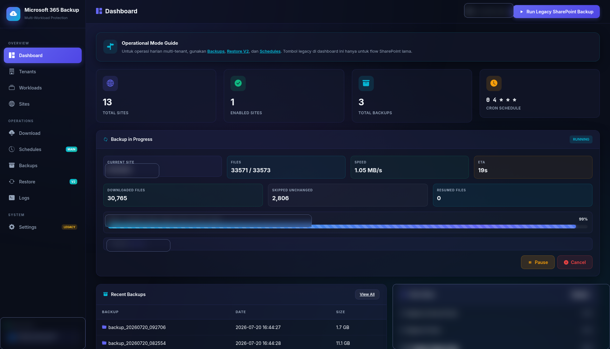

# Microsoft 365 Backup 

This is the active deployable application behind the Microsoft 365 Backup project.

If the root repository README is the product landing page, this folder is the actual engine room: web UI, task worker, scheduler, backup logic, restore flow, tenant management, and Docker deployment all live here.



## What This Application Actually Does

This application is used to run Microsoft 365 backup operations from a self-hosted stack.

Its role is to:

- connect to Microsoft 365 using tenant credentials
- run backup jobs in the background through worker processes
- store backup data in storage you control
- show progress, history, logs, and task status in a web UI
- prepare restore operations from collected backup data

In short:

- the root README explains the product and use case
- this folder explains the real application that powers it

All screenshots referenced from this package are taken from the running application and only sensitive areas are selectively blurred.

## What This Package Is Good At

- running as a portable self-hosted stack with Docker Compose
- backing up SharePoint with a real operator-facing UI
- exposing backup state, task state, and history more transparently than many opaque tools
- giving developers a clear codebase to patch, extend, and fork
- serving as a practical foundation for multi-workload Microsoft 365 backup operations

## Core Value

This package is useful when you want:

- a Microsoft 365 backup service you can host yourself
- a stack that is understandable without reverse engineering a monolith
- an interface your operations team can actually use
- a codebase where backup, restore, schedule, notification, and workload logic are still accessible to contributors

## What Is Inside

Main technical components:

- Flask web UI and API
- Celery worker for long-running backup and restore jobs
- Celery Beat scheduler
- Redis-backed task state and queueing
- backup engine for SharePoint and custom download flow
- backup registry for legacy and tenant-aware layouts
- restore v2 orchestration
- workload modules for SharePoint, OneDrive, Outlook, and Teams

## Portable Deployment Model

This package is intentionally structured so it can be cloned into almost any path and still run cleanly.

Default mount strategy:

```text
../data                -> /backup/sharepoint
../config/config.json  -> /app/config.json
../logs                -> /app/logs
../redis               -> /data
```

That gives you:

- portable host paths
- stable paths inside containers
- easier migration between servers
- simpler GitHub or GitLab sharing without hardcoded NAS-specific paths

## Folder Structure

```text
spo-backup-final/
├── app/
│   ├── main.py
│   ├── tasks.py
│   ├── backup_engine.py
│   ├── backup_registry.py
│   ├── tenant_manager.py
│   ├── uploader.py
│   ├── workloads/
│   ├── restore/
│   └── templates/
├── Dockerfile
├── docker-compose.yml
├── install-fixed.sh
├── install.sh
├── config.example.json
├── .env.example
└── requirements.txt
```

## Main Flows

### 1. SharePoint Backup

- launched from the dashboard
- uses enabled sites from config
- supports pause, resume, cancel, skip-unchanged, and partial-progress tracking
- stores legacy backup data under `/backup/sharepoint/backup_*`

### 2. Backup Inventory

- unifies legacy and tenant-aware backup layouts
- exposes workload, tenant, layout, size, and backup metadata
- feeds backup history and restore surfaces

### 3. Restore v2

- acts as the primary restore UI in the product
- supports SharePoint restore today
- contains workload-aware orchestration for broader Microsoft 365 recovery flows

### 4. Per-Tenant Scheduling

- `/schedules` is the primary schedule surface
- tenant-level cron and notification settings are stored per tenant
- `/settings` remains for legacy compatibility and system configuration

## Supported Backup Layouts

```text
/backup/sharepoint/backup_YYYYMMDD_HHMMSS
/backup/sharepoint/custom_<name>_<timestamp>
/backup/sharepoint/m365/<tenant-slug>/<workload>/backup_YYYYMMDD_HHMMSS
```

Why this matters:

- old backups remain readable
- newer product flows can move toward tenant-aware separation
- restore and audit surfaces can evolve without breaking all legacy paths at once

## Current Readiness

### Ready Enough For Real Use

- Dockerized deployment
- SharePoint backup execution
- unified backup listing
- restore v2 UI and API surface
- per-tenant scheduling UI
- non-root runtime

### Under Active Hardening

- legacy SharePoint interruption and resume behavior
- backup snapshot integrity when runs are interrupted
- clearer separation between legacy and modern product flows
- remote upload correctness across all workload shapes

### Permission Dependent In Real Tenants

- OneDrive discovery and backup
- Outlook discovery and backup
- Teams discovery and backup
- workload restore readiness beyond SharePoint

## Quick Start

```bash
cd spo-backup-final
cp .env.example .env
mkdir -p ../config ../data ../logs ../redis
cp -n config.example.json ../config/config.json
sh install-fixed.sh
```

Then open:

```text
http://<host>:5050
```

## Environment Variables

Default values from [`.env.example`](.env.example):

```env
SECRET_KEY=digiserve-spo-backup-2026-change-me
TZ=Asia/Jakarta
SPO_WEB_PORT=5050
SPO_UID=1000
SPO_GID=1000
SPO_DATA_DIR=../data
SPO_CONFIG_FILE=../config/config.json
SPO_LOG_DIR=../logs
SPO_REDIS_DIR=../redis
```

Important notes:

- `SPO_UID` and `SPO_GID` keep web, worker, and beat running as non-root
- path variables can be overridden for a different host layout
- runtime secrets belong in ignored local files, not in Git

## Security and Public Sharing

Do not commit:

- real `config.json`
- real `.env`
- backup payload from `data/`
- runtime logs from `logs/`
- Redis state from `redis/`

Use:

- [`config.example.json`](config.example.json) as the public config template
- [`.env.example`](.env.example) as the public environment template

If any real secret was used locally before publication, rotate it before pushing the repository.

## Operational Commands

Run from `spo-backup-final/`:

```bash
docker compose up -d
docker compose down
docker compose build
docker compose ps
docker compose logs -f spo-backup
docker compose logs -f celery-worker
docker compose logs -f celery-beat
docker compose restart spo-backup
docker compose restart celery-worker
docker compose restart celery-beat
```

## Related Docs

- Root guide: [../README.md](../README.md)
- Audit findings: [../docs/AUDIT_CHECKLIST_TEMUAN.md](../docs/AUDIT_CHECKLIST_TEMUAN.md)
- Execution status: [../docs/CHECKLIST_EKSEKUSI_STATUS.md](../docs/CHECKLIST_EKSEKUSI_STATUS.md)
- Remediation PRD: [../docs/PRD_CHECKLIST_REMEDIASI.md](../docs/PRD_CHECKLIST_REMEDIASI.md)
